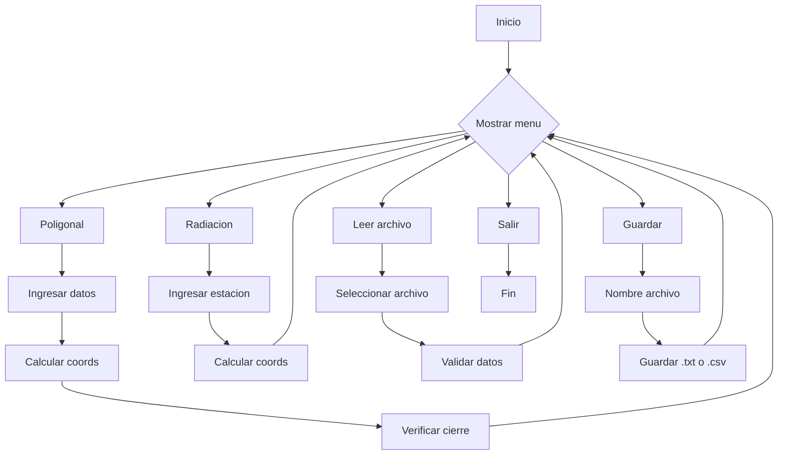
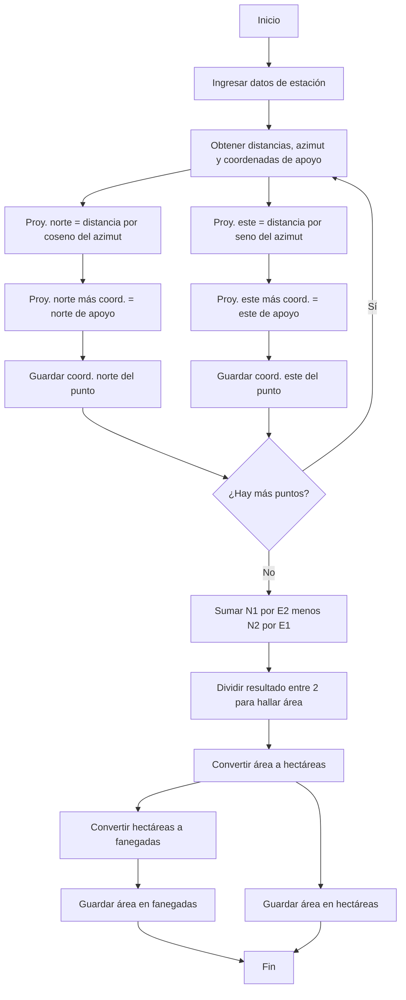

# PROYECTO FINAL
## TopograficTool - Herramienta para Cálculos Topográficos en Ingeniería Civil
## Autores
- Santiago Ramos Barriga
- Maria Camila Palomo

Curso: Programación de Computadores  
Grupo: 404 CNF (Chill Not Found)  
Universidad Nacional de Colombia

## Problema
En la Ingeniería Civil, una de las actividades fundamentales en proyectos de obras civiles (como carreteras, redes de acueducto, edificaciones, puentes, etc.) es la topografía, que permite conocer y representar el terreno de forma precisa. Actualmente estamos cursando la asignatura de Geomática Básica dónde hemos encontrdo dificultades a la hora de hallar soluciones rapidas a los problemas dados, ya que la toma de datos se realiza muchas veces manualmente o en hojas de cálculo, lo cual consume tiempo y puede generar errores. Se necesita una herramienta por consola que automatice este proceso para estudiantes y técnicos.

## Solución
La idea de este programa es crear una herramienta por consola en Python llamada TopograficTool, que permita a los usuarios calcular coordenadas, cierres, y correcciones de poligonales (abiertas y cerradas) y radiaciones (simples y dobles), usando datos ingresados manualmente o desde archivos ".txt" o ".csv".

## ¿Cómo funcionaría?
Un estudiante está en clase de Geomática. Luego de levantar datos con el teodolito (insumo utilizado en las prácticas para medir distancias y ángulos de un terreno), debe procesarlos:
- Cargar los puntos medidos
- Calcular las coordenadas de los puntos y las distancias
- Verificar si es poligonal abierta o cerrada
- Corregir errores
- Exportar los resultados a un informe

## Diagrama preliminar

## Diagrama preliminar para radiación simple    
Presentamos el ejemplo de solución para el caso de radiación simple, donde se ingresan las distancias, ángulos (azimut) y coordenadas de apoyo, y a partir de estos datos se calculan las proyecciones en norte y este, las coordenadas de cada punto, y finalmente el área del polígono formado. Esta área se convierte automáticamente en hectáreas y fanegadas.

La estructura y lógica aplicada en este ejemplo está pensada para extenderse fácilmente a otros métodos, como la radiación doble, la poligonal cerrada y la poligonal abierta, obviamente, cada método requiere ciertos ajustes y condiciones específicas, pero la base del procedimiento (proyecciones, coordenadas, y cálculo de áreas) se mantiene. De esta manera el diagrama de flujo que representa el proceso completo es el siguiente:    

